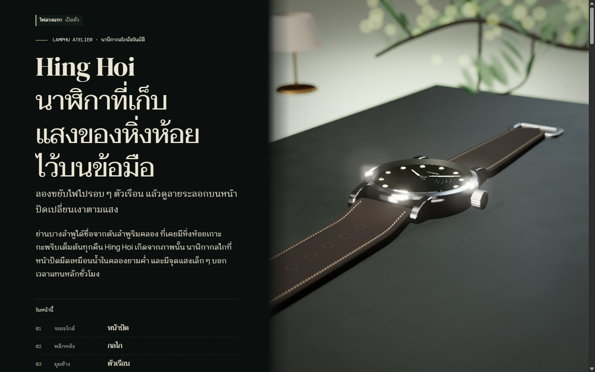
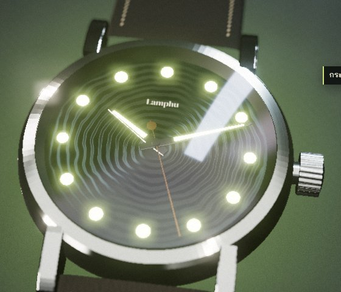

# OpenWebX

**Turn any content into a premium interactive 3D web experience, in any theme.**
Give it a theme and a file or folder. An agent team reads the content, picks the
strongest concept, writes a creative brief, builds a Three.js site on a tested
runtime kit, and checks it in a real browser. Want a say? Add `--ask` and the
decisions arrive as pop-up choices, each with a recommended answer.


<sub>The bundled example, rendered live in the browser. More below under [Example](#example).</sub>

```
/openwebx:create "Lord of the Rings" ./content/my-seo-article.md
/openwebx:create "minimal luxury" ./portfolio/projects.json --ask   # pop-up choices first
/openwebx:grill-me ./openwebx-out/<slug>          # deep art-direction interview
```

## What you get
- **Two inputs, nothing else.** Facts (language, structure, FAQ, images) are read
  from your content and never asked. Taste decisions are made for you unless you
  ask to choose.
- **Forms, not genres.** The director reads the content's shape (sequence,
  collection, argument, single subject, reference) and chooses how the world
  carries it: a path, a stage, an assembly, a map, or an arc of hours.
- **A runtime kit, not a blank canvas:**
  - content readable at first paint; the world joins when ready
  - contents list and per-chapter running heads inside the page
  - labels anchored to scene objects; the system cursor is left alone
  - inertial scroll story coordinate
  - synthesized sound, offered in the page and always off at first
  - adaptive DPR/quality
  - prefers-reduced-motion, no-WebGL and no-JS fallbacks
  - a self-reporting probe for QA
- **Content stays sacred.** Your text is rendered verbatim as semantic HTML in
  source order: crawlable, printable, readable without JavaScript. The build
  adds meta, Open Graph and JSON-LD (Article, FAQPage, CollectionPage…).
- **Any content:** SEO articles, portfolios, product pages, docs, reports and
  stories, in `.md` `.txt` `.html` `.json` `.csv`, as a single file or a folder.
- **Thai-first typography:** script-aware word reveal (`Intl.Segmenter`),
  Thai font pairing, and no tracking or clipped tone marks.
- **Inspired-by themes only.** Franchise names, logos, fonts and quotes are
  blocked from authored copy, so the sites are safe to publish.
- **Cinematic realism by default.** A realism toolkit (physical sky, HDRI
  image-based lighting, PBR materials, fbm terrain, layered mist, soft
  shadows, and a camera finish with bloom, depth of field, grading, grain and
  vignette), plus free **CC0** HDRIs, textures and models fetched from
  Poly Haven at build time.
- **Share first.** Every site is also packed into one `present.html`. On
  Claude it is published as a shareable Artifact; on ChatGPT or Gemini it
  opens in Canvas.
- **Quality gates:** static QA (verbatim content, SEO head, pinned CDN, import
  graph, JS syntax, scene contract, IP terms) plus a browser critic (console,
  FPS, every chapter screenshotted, mobile, reduced motion, fallback).

## Install

```bash
claude plugin marketplace add platprompt/openwebx
claude plugin install openwebx@openwebx
```

Requirements: Python 3.9+ (standard library only). Node.js is optional and
enables JS syntax checks. Pillow is optional and converts images to WebP. For
browser QA, the session needs a browser tool (the Claude desktop browser pane,
Playwright MCP or Claude in Chrome). Generated sites load three.js and GSAP
from jsDelivr with pinned versions.

## How it works

```
theme + content ─► ingest.py ─► content.json (sections, lang, FAQ, images)
                        │
             director (auto) ─► 3 concepts, picks the best ─► brief.json + brief.md
                        │        (with --ask: pop-up choices first, recommended first)
                        │
                  scaffold.py ─► openwebx-out/<slug>/  (runtime kit + verbatim content + SEO)
                        │
                     builder ─► src/scene/** + css/theme.css   (qa.py must pass)
                        │
                     critic  ─► browser gates + rubric ─► fix loop (≤ 2) ─► delivery
```

View a site with `python openwebx-out/<slug>/serve.py`. Deploy by uploading the
folder to any static host.

## Repository layout

```
.claude-plugin/marketplace.json
plugins/openwebx/
  .claude-plugin/plugin.json   .codex-plugin/plugin.json   VERSION   LICENSE
  agents/        openwebx-director.md  openwebx-builder.md  openwebx-critic.md
  skills/create/ SKILL.md  references/  scripts/  runtime/  agents/openai.yaml
  skills/grill-me/SKILL.md
  examples/      content/ (sample inputs)  sites/ (acceptance demos)
scripts/validate.py            bundle validator (versions, manifests, frontmatter, paths, syntax)
tests/test_pipeline.py         python -m unittest discover -s tests
```

## Example

**Hing Hoi** ([open `present.html`](plugins/openwebx/examples/sites/lamphu-hing-hoi-one-light/present.html)):
a product page for a fictional mechanical watch, staged as one night in a small
product studio. The page text is Thai (the source content was Thai; any
language works). Reading model `beside`, a procedural watch, and one light the
reader holds: hold to charge the lume, release and the room goes dark.

| Dial close-up | After the hold: the lume glows | Phone |
| --- | --- | --- |
|  |  |  |

Every frame is rendered live in the browser (Three.js); nothing is a
pre-rendered image.

The folder also contains `artifact.html` for Claude Artifacts and `serve.py`
for local viewing. When this host does not expose Canvas, paste the complete
`present.html` into a ChatGPT or Gemini HTML Canvas and select Preview.
CDN access is still required for Three.js, GSAP and fonts.


## Develop

```bash
python scripts/validate.py
python -m unittest discover -s tests -v
```

Keep `VERSION`, both plugin manifests, the marketplace entry and the runtime
`RUNTIME_VERSION` in lock-step. The validator enforces this.

## Third-party notices
- **Powered by Poly Haven:** CC0 asset search and downloads use the
  [Poly Haven API](https://polyhaven.com). The assets are CC0, and credit in
  your generated sites is optional.
- Simplex noise GLSL is by Ashima Arts / Stefan Gustavson (MIT).
- Generated sites load three.js (MIT) and GSAP (free license) from jsDelivr.

## License
MIT © BIQDADDY
