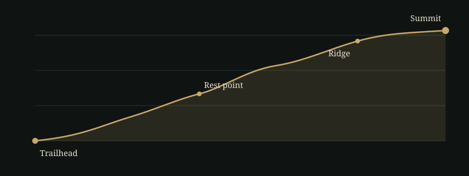

# เดินป่าขึ้นดอยครั้งแรก: คู่มือเตรียมตัวฉบับสมบูรณ์สำหรับมือใหม่

การเดินป่าขึ้นดอยครั้งแรกไม่ได้ต้องการความแข็งแรงระดับนักกีฬา แต่ต้องการการเตรียมตัวที่ถูกต้อง คู่มือนี้รวบรวมทุกขั้นตอนที่มือใหม่ควรรู้ ตั้งแต่การเลือกเส้นทางที่เหมาะกับระดับร่างกาย การฝึกซ้อมล่วงหน้า การจัดเป้ ไปจนถึงมารยาทที่ช่วยให้ธรรมชาติยังคงงดงามสำหรับคนรุ่นถัดไป

## เลือกเส้นทางแรกให้เหมาะกับตัวเอง

เส้นทางแรกควรเป็นเส้นทางที่ **มีเจ้าหน้าที่ดูแล มีจุดพักชัดเจน และใช้เวลาไม่เกินหนึ่งวัน** เพื่อให้ร่างกายได้เรียนรู้จังหวะการเดินขึ้นเขาโดยไม่ต้องแบกน้ำหนักค้างคืน

ปัจจัยที่ควรพิจารณาก่อนตัดสินใจ:

- **ระยะทางและความชัน** เส้นทางระยะสั้นที่ชันมากอาจเหนื่อยกว่าเส้นทางยาวที่ลาดเอียงสม่ำเสมอ
- **ฤดูกาล** หลายอุทยานปิดบางเส้นทางในฤดูฝนเพื่อฟื้นฟูธรรมชาติ ควรตรวจสอบประกาศของอุทยานแห่งชาติก่อนเดินทางทุกครั้ง
- **การจองล่วงหน้า** เส้นทางยอดนิยมจำกัดจำนวนนักท่องเที่ยวต่อวัน และบางแห่งกำหนดให้ต้องมีผู้นำทางท้องถิ่น
- **การเดินทางไปจุดเริ่มต้น** เผื่อเวลาสำหรับถนนบนเขาที่คดเคี้ยวและสภาพอากาศที่เปลี่ยนเร็ว

## เตรียมร่างกายล่วงหน้าอย่างน้อยหนึ่งเดือน

ร่างกายที่พร้อมทำให้การเดินขึ้นเขาเปลี่ยนจากความทรมานเป็นความสนุก เริ่มจากกิจกรรมที่ทำได้จริงทุกสัปดาห์:

1. เดินเร็วหรือวิ่งเหยาะ 30–45 นาที สัปดาห์ละ 3 ครั้ง เพื่อสร้างความอึดของหัวใจและปอด
2. เดินขึ้นบันไดหรือเนิน โดยค่อย ๆ เพิ่มจำนวนชั้น เพื่อฝึกกล้ามเนื้อต้นขาและน่อง
3. ฝึกเดินพร้อมเป้ที่มีน้ำหนักใกล้เคียงวันจริงในสองสัปดาห์สุดท้าย
4. ยืดเหยียดหลังออกกำลังกายทุกครั้ง โดยเฉพาะสะโพก ต้นขาด้านหลัง และน่อง

> ร่างกายไม่ได้ต้องการความแข็งแรงที่สุด แต่ต้องการความคุ้นเคยกับการเคลื่อนไหวแบบเดียวกับวันจริง

## จัดเป้ให้เบาแต่ครบ

หลักการสำคัญคือ **พกสิ่งที่ต้องใช้จริงและสิ่งที่ช่วยชีวิตได้** น้ำหนักทุกกรัมจะรู้สึกหนักขึ้นเมื่อเดินไปครึ่งทาง

| หมวด | สิ่งที่ควรมี | หมายเหตุ |
|---|---|---|
| น้ำและอาหาร | น้ำดื่ม ขนมพลังงานสูง | ประเมินปริมาณน้ำตามระยะทางและอากาศ |
| เสื้อผ้า | เสื้อระบายเหงื่อ เสื้อกันหนาวบาง เสื้อกันฝน | บนยอดดอยอุณหภูมิลดลงเร็วมากหลังพระอาทิตย์ตก |
| ความปลอดภัย | ไฟฉายคาดหัว ชุดปฐมพยาบาล นกหวีด | ตรวจแบตเตอรี่ก่อนออกเดินทาง |
| การนำทาง | แผนที่ออฟไลน์ แบตเตอรี่สำรอง | สัญญาณโทรศัพท์บนเขาไม่แน่นอน |
| ของส่วนตัว | ครีมกันแดด ยาประจำตัว ถุงเก็บขยะ | นำขยะทุกชิ้นกลับลงมาด้วย |

รองเท้าคืออุปกรณ์ที่สำคัญที่สุด เลือกรองเท้าที่พื้นยึดเกาะดีและ *เคยใส่เดินมาแล้ว* อย่างน้อยสองสามครั้ง รองเท้าใหม่ที่ยังไม่เข้ากับเท้าคือสาเหตุอันดับต้น ๆ ของแผลพุพอง

## วันเดินทาง: จังหวะคือทุกอย่าง

ออกเดินแต่เช้าเพื่อหลีกเลี่ยงแดดจัดและเผื่อเวลาสำหรับเหตุไม่คาดฝัน เดินในจังหวะที่ยังพูดคุยเป็นประโยคได้ ถ้าหอบจนพูดไม่ได้แปลว่าเร็วเกินไป

- พักสั้น ๆ บ่อย ๆ ดีกว่าพักนานไม่กี่ครั้ง เพราะกล้ามเนื้อจะไม่เย็นตัวลง
- จิบน้ำทีละน้อยสม่ำเสมอ แทนการดื่มครั้งละมาก ๆ
- ขาลงอันตรายกว่าขาขึ้น ก้าวสั้น งอเข่าเล็กน้อย และใช้ไม้เท้าเดินป่าช่วยลดแรงกระแทก
- ตั้ง "เวลากลับตัว" ไว้ล่วงหน้า ถ้าถึงเวลานั้นแล้วยังไม่ถึงยอด ให้กลับลงมา ยอดเขาจะยังอยู่ที่เดิมเสมอ

## มารยาทบนเส้นทาง

ธรรมชาติบนดอยฟื้นตัวช้ากว่าที่เราคิด มารยาทพื้นฐานช่วยให้ทุกคนยังได้เห็นภาพเดียวกับที่เราเห็น

- เดินในเส้นทางที่กำหนด ไม่ลัดเส้นทางเพราะจะทำให้หน้าดินพังทลาย
- ไม่เก็บพืช ดอกไม้ หรือหินกลับบ้าน
- ใช้เสียงเบา ๆ เพื่อไม่รบกวนสัตว์ป่าและผู้เดินทางคนอื่น
- ผู้ที่กำลังเดินขึ้นเขามีสิทธิ์ใช้ทางก่อนผู้ที่เดินลง
- นำขยะทุกชิ้นกลับลงมา รวมถึงเปลือกผลไม้ที่ย่อยสลายได้

## คำถามที่พบบ่อย

### มือใหม่ที่ไม่เคยออกกำลังกายเลย เดินป่าขึ้นดอยได้ไหม?

ได้ หากเลือกเส้นทางระยะสั้นที่มีเจ้าหน้าที่ดูแล และเริ่มเตรียมร่างกายล่วงหน้าอย่างน้อยสี่สัปดาห์ ผู้ที่มีโรคประจำตัวควรปรึกษาแพทย์ก่อนเดินทาง

### ควรพกน้ำไปเท่าไหร่?

ขึ้นอยู่กับระยะทาง อุณหภูมิ และจุดเติมน้ำบนเส้นทาง ควรสอบถามเจ้าหน้าที่อุทยานถึงจุดเติมน้ำ และพกเผื่อมากกว่าที่คาดไว้เล็กน้อยเสมอ เพราะการขาดน้ำบนเขาอันตรายกว่าการแบกน้ำเกิน

### ต้องจ้างผู้นำทางไหม?

บางเส้นทางกำหนดให้ต้องมีผู้นำทางท้องถิ่น และแม้ในเส้นทางที่ไม่บังคับ ผู้นำทางก็ช่วยเรื่องความปลอดภัยและเล่าเรื่องราวของผืนป่าที่เราอาจมองข้ามไป ทั้งยังเป็นการกระจายรายได้สู่ชุมชน

### ถ้าเกิดอาการบาดเจ็บระหว่างทางควรทำอย่างไร?

หยุดเดินทันที แจ้งเพื่อนร่วมทางหรือเจ้าหน้าที่ ประเมินอาการเบื้องต้นด้วยชุดปฐมพยาบาล และอย่าฝืนเดินต่อหากอาการไม่ดีขึ้น การตัดสินใจกลับลงมาไม่ใช่ความล้มเหลว แต่คือทักษะสำคัญของนักเดินป่าที่ดี

## ก้าวแรกสำคัญที่สุด

ทริปแรกไม่จำเป็นต้องยิ่งใหญ่ ขอเพียงปลอดภัย สนุก และทำให้อยากกลับไปอีก เมื่อร่างกายและใจคุ้นเคยกับภูเขาแล้ว เส้นทางที่ท้าทายกว่าจะรออยู่เสมอ เตรียมตัวให้ดี ออกเดินแต่เช้า และปล่อยให้ภูเขาเป็นครูคนแรกของคุณ
